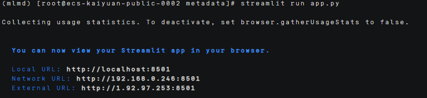
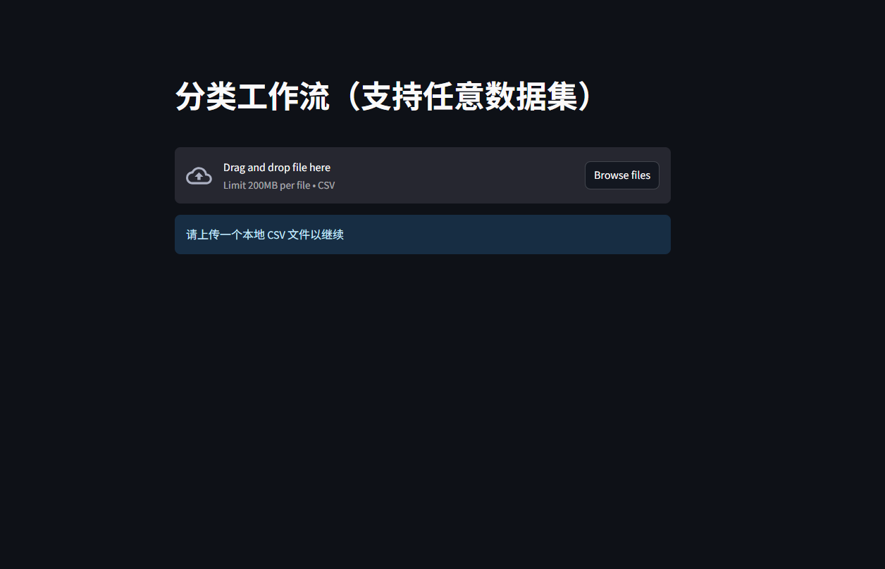
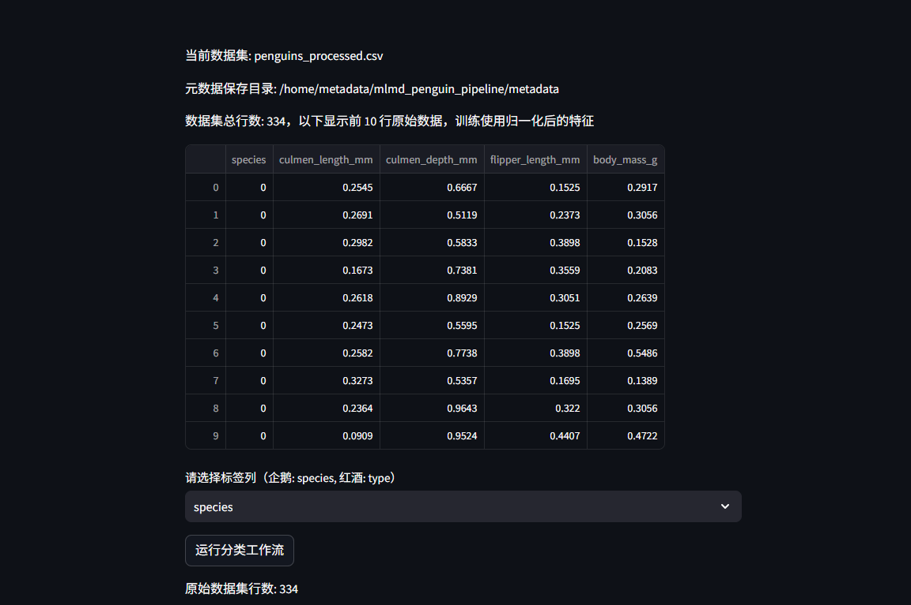
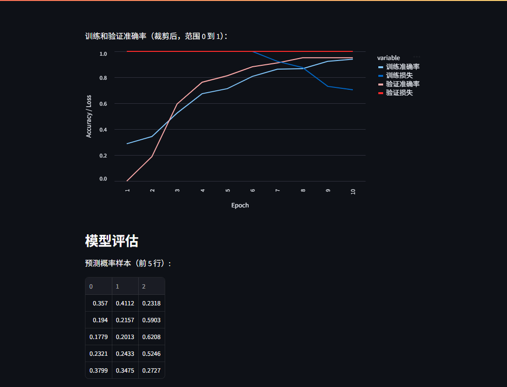
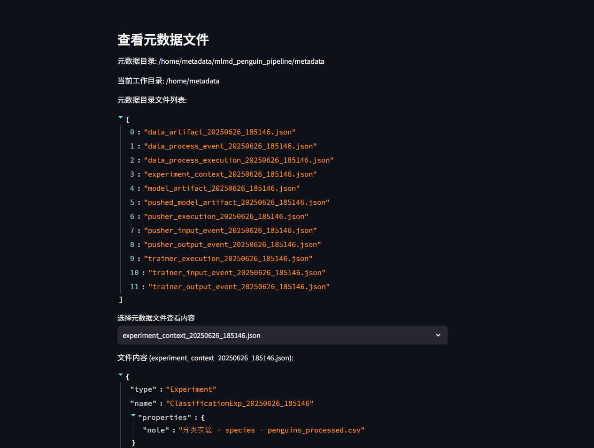

# MLMD部署指南


## ‌一、环境准备


### 更新系统


#### EulerOS2.0


```
yum -y update  
yum -y upgrade
```


#### Ubuntu 24.04


```
apt-get -y update
export DEBIAN_FRONTEND=noninteractive
apt-get -y -o Dpkg::Options::="--force-confold" dist-upgrade
```


## **二、安装conda**


```
mkdir -p ~/miniconda3

wget https://repo.anaconda.com/miniconda/Miniconda3-latest-Linux-aarch64.sh -O ~/miniconda3/miniconda.sh

bash ~/miniconda3/miniconda.sh -b -u -p ~/miniconda3

rm -f ~/miniconda3/miniconda.sh

source ~/miniconda3/bin/activate

conda init --all
```


创建虚拟环境

```
conda create -n mlmd python=3.8
```

## **三、源码下载**

### **1.下载源码**

```
git clone https://github.com/tensorflow/metadata.git

yum makecache 

yum install -y hdf5-devel 

pip install tensorflow-metadata==1.14.0 tensorflow==2.13.0 pandas==1.5.3 numpy==1.22.4 -ihttps://pypi.tuna.tsinghua.edu.cn/simple 

pip install streamlit -i https://pypi.tuna.tsinghua.edu.cn/simple

pip install scikit-learn -i https://pypi.tuna.tsinghua.edu.cn/simple

pip uninstall h5py
```


### **2.下载数据集**

```
mkdir -p /home/metadata/data

wget -O /home/metadata/data/penguins_processed.csv https://raw.githubusercontent.com/tensorflow/tfx/master/tfx/examples/penguin/data/labelled/penguins_processed.csv 
```


## **四、启动项目**

### **1.修改代码**

[app.py](../scripts/app.py)

 


## **2.运行实现**

streamlit run app.py

运行之后会显示如下



然后使用最后一个网址打开网页。

 

 

使用企鹅分类数据集进行测试（penguins_processed.csv),葡萄酒数据集也已测试成功（winequality-red.csv)。

导入数据集后，就能够运行工作流，让就能获得数据集、模型训练、查询元数据等内容。



导入数据后会显示数据集名称和部分数据集内容展示，然后运行分类工作流就能进行后续的模型训练和评估、查询元数据。



 
