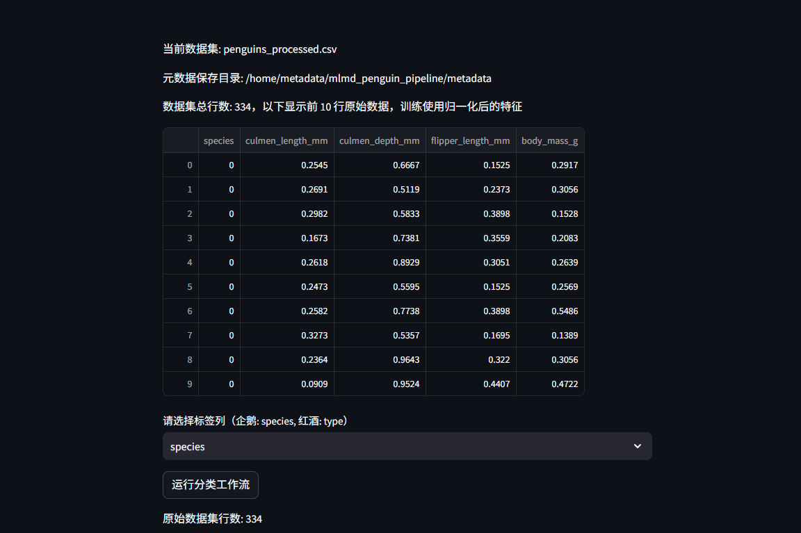

# MLMD机器学习元数据管理系统使用指南


# 一、商品链接


[MLMD机器学习元数据管理系统](https://marketplace.huaweicloud.com/hidden/contents/10e68a87-10f0-4245-a3f4-77eea4e91916#productid=OFFI1148940556404793344)

# 二、商品说明


MLMD是由Google推出的开源元数据管理组件，专为机器学习系统设计，记录并管理机器学习模型训练、数据集等各种信息，能够实现模型的可追溯性、可重复性和合规性审查。本商品通过鲲鹏服务器+EulerOS2.0进行安装部署

# 三、商品购买


您可以在云商店搜索 **MLMD机器学习元数据管理系统**。

其中，地域、规格、推荐配置使用默认，购买方式根据您的需求选择按需/按月/按年，短期使用推荐按需，长期使用推荐按月/按年，确认配置后点击“立即购买”。

## 3.1 使用 RFS 模板直接部署


 
必填项填写后，点击 下一步


创建直接计划后，点击 确定


点击部署，执行计划

如下图“Apply required resource success. ”即为资源创建完成


# 3.2ECS 控制台配置


### 准备工作


在使用ECS控制台配置前，需要您提前配置好 **安全组规则**。

> **安全组规则的配置如下：**
>
> - 入方向规则放通端口8501，必须包含这些端口才能正常访问使用
> - 入方向规则放通 CloudShell 连接实例使用的端口 `22`，以便在控制台登录调试
> - 出方向规则一键放通

### 创建ECS


前提工作准备好后，选择 ECS 控制台配置跳转到[购买ECS](https://support.huaweicloud.com/qs-ecs/ecs_01_0103.html) 页面，ECS 资源的配置如下图所示：

选择CPU架构 

选择服务器规格 
选择镜像 
其他参数根据实际请客进行填写，填写完成之后，点击立即购买即可 


> **值得注意的是：**
>
> - VPC 您可以自行创建
> - 安全组选择 [**准备工作**](#准备工作) 中配置的安全组；
> - 弹性公网IP选择现在购买，推荐选择“按流量计费”，带宽大小可设置为5Mbit/s；
> - 高级配置需要在高级选项支持注入自定义数据，所以登录凭证不能选择“密码”，选择创建后设置；
> - 其余默认或按规则填写即可。

# 商品使用


## MLMD使用

首先启动虚拟环境进入运行目录：
```
conda activate mlmd

cd /home/metadata
```
运行启动代码：
```
streamlit run app.py
```


然后使用https://ip+8501启动网页


导入数据集是从本地导入的，所以将数据集下载到本地

https://raw.githubusercontent.com/tensorflow/tfx/master/tfx/examples/penguin/data/labelled/penguins_processed.csv

然后导入之前下载的penguins_processed.csv数据集



导入数据集后会显示数据集的信息以及部分内容，然后运行分类工作流即可。然后就能获得模型训练评估和查看元数据。


查看元数据选择元数据文件可查看文件内容。

### 参考文档


[MLMD官方文档](https://github.com/tensorflow/metadata)

